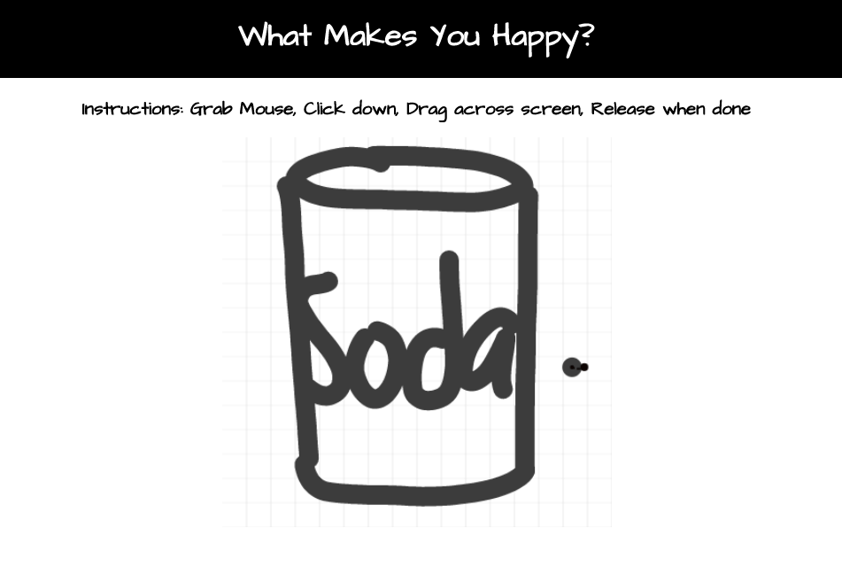

# Spike Solo Project

## Description

_Duration: 10 Hour Code Fun_

Create an application which allows users to interact with the DOM by drawing on the HTML browser.

## Screen Shot

<!--  --> 
<!-- Must resize image first, will return to this portion -->

### Prerequisites

Link to software that is required to install the app (e.g. node).

- [Node.js](https://nodejs.org/en/)

## Installation

1. Created folder on local computer
2. Open terminal
3. Run `npx create-react-app repo-name` in terminal
4. Run`cd repo-name` in terminal
5. Run `code .` in terminal to open repository in VS CODE if this is your editor, otherwise utilize terminal command appropriately matching your editor of choice.
6. Run `git init` in terminal
7. Run `git remote add origin https://github.com/your_github_username/your_repo_name` in terminal
8. Run `git add .` in terminal to add initial set up files
9. Run `git commit -m 'Your commit message'`
10. Run `git push -u origin master` in terminal
11. Run `Run npm install react-canvas-draw`
        (however, I ran into issues so per the git errand, I ran
        `npm install react-canvas-draw --legacy-peer-deps`
 
 and it worked.)

## Usage
How does someone use this application? Tell a user story here.

1. Open in HTML browser
2. Utilize mouse by holding down on click and dragging across browser 
3. Let go of mouse click to release drawing

## Built With

* HTML
* CSS 
* JavaScript
* React
* React Canvas

## Acknowledgement
Thanks to [Prime Digital Academy](www.primeacademy.io) who equipped and helped me to make this application a reality. (Thank your people)
Also, a big thank you to my wonderful instructor, Mary Mosman.

## Support
If you have suggestions or issues, please email me at [maivyerthao@gmail.com](www.google.com)